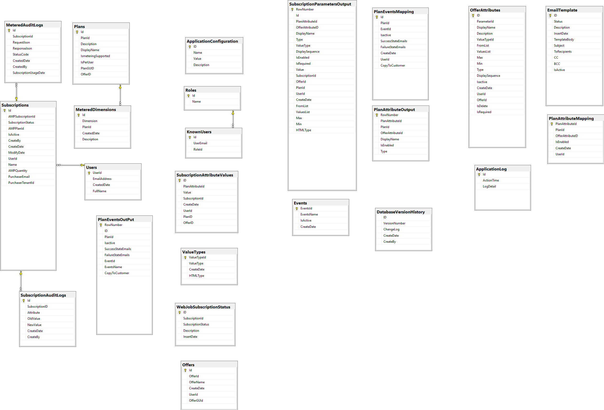

# Transactable SaaS SDK Sample Database

### Introduction

The Provisioning and the Publisher applications use SQL Server database as the data source to store subscriptions and the status, metered dimensions by plans and activity against subscriptions.

### Description 

The following picture illustrates the entities and the relationships among them:

 

| Entity | Description |
| --- | --- |  
| ApplicationConfiguration | Holds application level configuration like SMTP details and feature flags |
| ApplicationLog  | Activity in the application is tracked via a custom logger implementation |
| KnownUsers | Users that can log on to the Publisher web application. Publisher should initialize this table to allow users to access the Publisher web application |
| MeteredAuditLogs | The request and response against metering API is stored here. Helps troubleshoot issuses when posting usage data to Azure |
| MeteredDimensions  | Stores the meters related to plans |
| Plans  | All the plans related to the marketplace offer are stored here|
| Roles | Defins one role PublisherAdmin and is assigned to users that can log on to Publisher web application|
| Subscriptions  | Holds the Subscriptions against the marketplace offer and the latest status |
| SubscriptionAuditLogs  | Activity against a subscription due to actions like activation, change plan and unsubscribe are tracked here|
| SubscriptionLicenses | Licenses assigned to subscriptions are stored here |
| Users | Holds the users auto-registered via the Provisioning service |

### Application Configuration

Application configuration is initialized with the following keys that the publisher has to update with appropriate values:

| Key | Description|
| --- | -- |
| ApplicationName | Name of the application |
| IsEmailEnabledForSubscriptionActivation | Flag that defines if an email has to be sent out when a subscription is activated |
| IsEmailEnabledForUnsubscription | Flag that defines if an email has to be sent out when a subscription is deleted |
| IsLicenseManagementEnabled | Flag that defines if license management feature should be enabled in Provisioning and the Publisher web applications |
| SMTPFromEmail | From email address for the emails |
| SMTPHost | SMTP server name |
| SMTPPassword | Password in the credential to connect to the SMTP server |
| SMTPPort | SMTP Port name |
| SMTPSslEnabled | Is SMTP SSL enabled |
| SMTPUserName | Username in the credential to connect to the SMTP server |

### EmailTemplate

Email template table contains a predefined set of templates for the emails sent out when a subscription is activated / deleted.
Publisher is required to update the ToRecipients ( list of emails separted by a ;), CC and BCC on the template entries in the EmailTemplate table.
The Body of the email is HTML and can be modified using a text editor.
