# Azure Application Registration Credentials Monitoring
Currently AAD  do not have a native feature to report on expiring App registrations credentials. It is essential to impement solution to monitor and report when application credentials is about to expire so IT team can rotate the secret and update the configuration for any azure services using this application.

There are many open sources powershells scripts that address this issue. This tourtial will show how to implement a workaround and automated the process to monitor application credentials. The solution will require the following services
1- [SendGrid](https://docs.sendgrid.com/for-developers/partners/microsoft-azure) Free plan
2- Azure Automation(https://docs.microsoft.com/en-us/azure/automation/overview)
3- PowerShell Script  

### 1- Deploy SendGrid
From Azure portal marketplace search for SendGrid and subscribe, this demo will use Free Tier
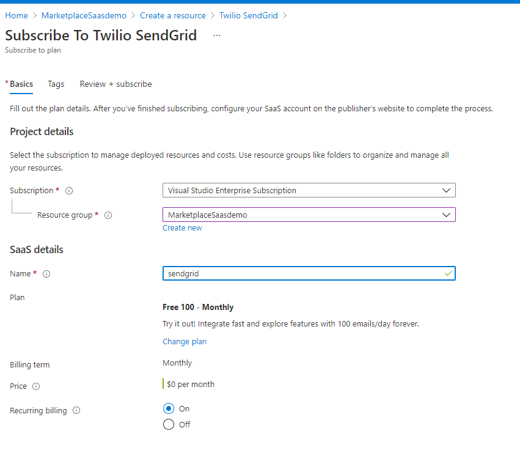

After Subscription complete access SendGrid and configure a Sender and verify it
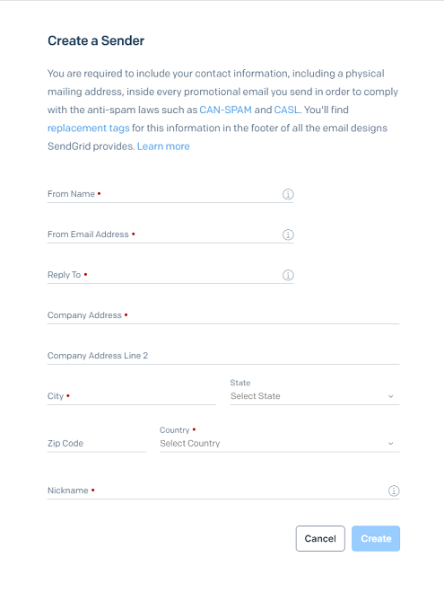

Then generate **API Key** it will be needed for the powershell script

### 2- Deploy Azure Automation
From Azure portal serach for Azure Automation and create an instance
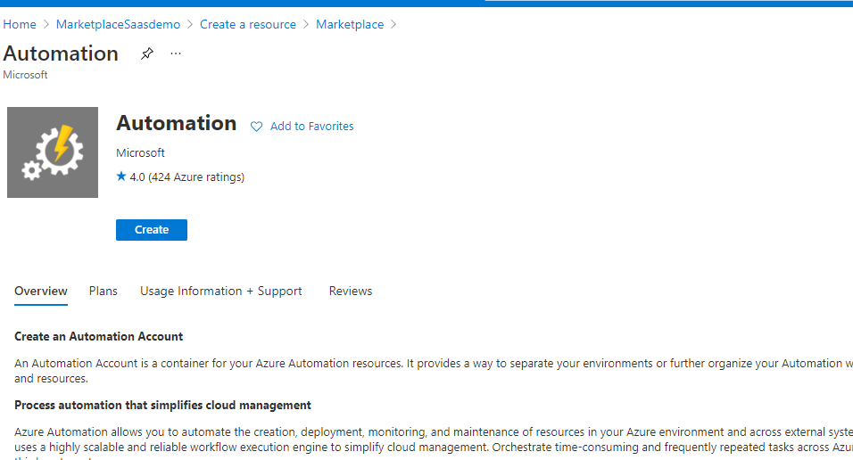
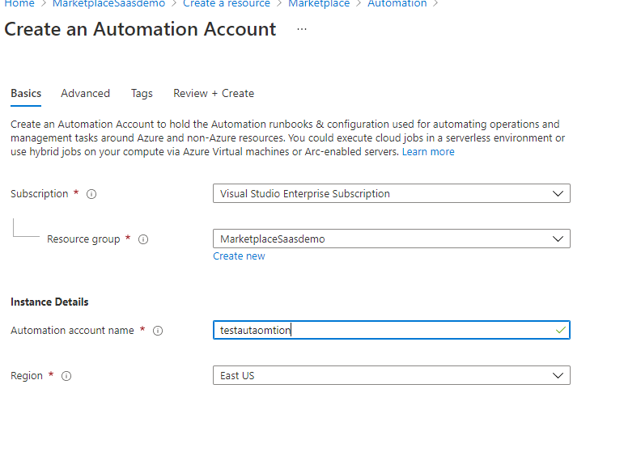

After Creating the Automation Service, We will need to create **AzureRunAsAccount** to execute the powershell later

From the left panel under **Account Settings** -> **Run as accounts** Create an account
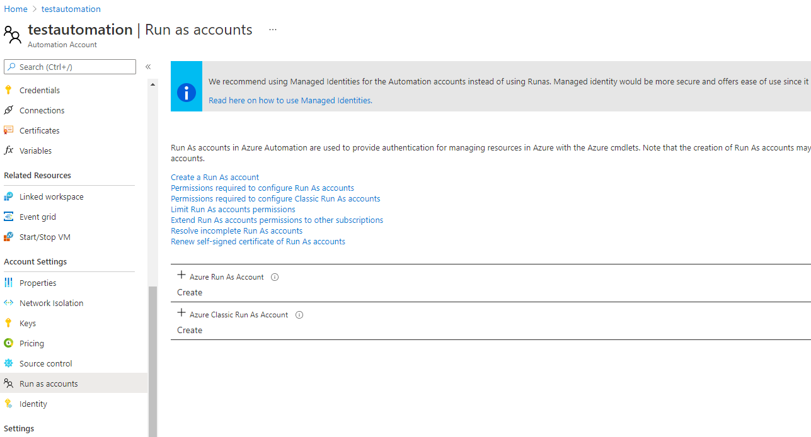

Now since the Account is created, it is **Critical** to grant this account the correct permission over AAD application

From AAD, Select **Roles and administrators** then click **Application administrator**
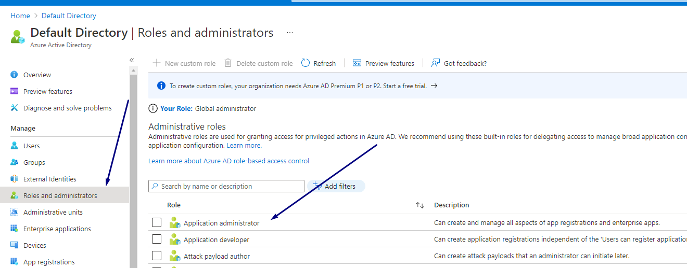

Add Assignment and Search for the automation account was created earlier and assign it
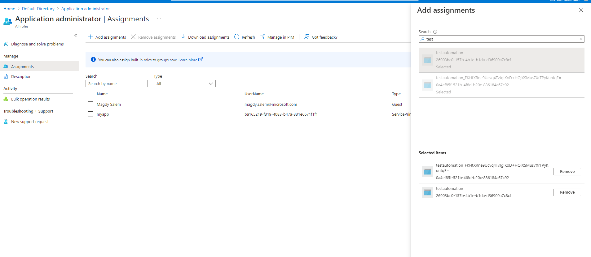

### 4- Add RunBook
From Automation main page select **Runbooks** 
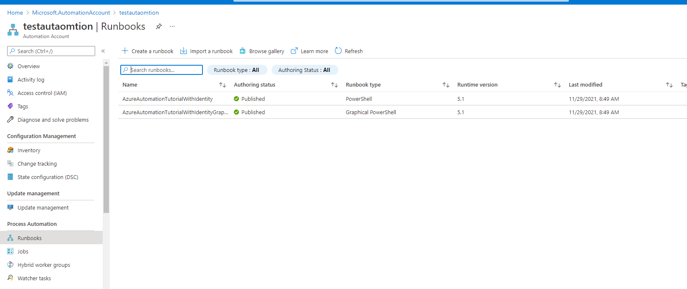

You can select existing script from gallery by search for keyword **expired** then you can take the script and modify it to just show expired application
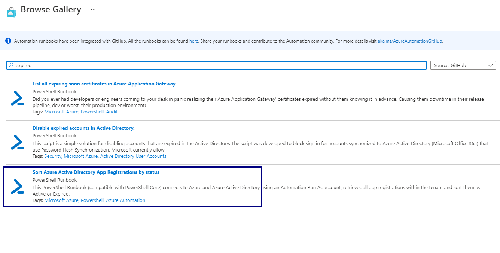

Or Create custom powershell script based on existing [scripts](https://raw.githubusercontent.com/SIbanez1990/azautomation/main/auditexpireingspns.ps1). Click  **Create a runbook**

Fill the script name and description
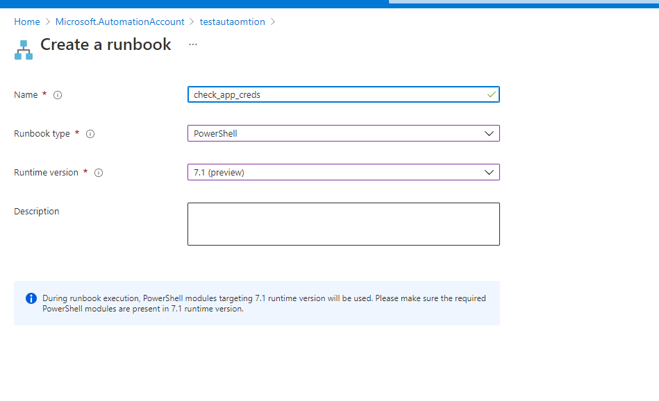

Once the script in created Click on **Edit** from the runbook main page
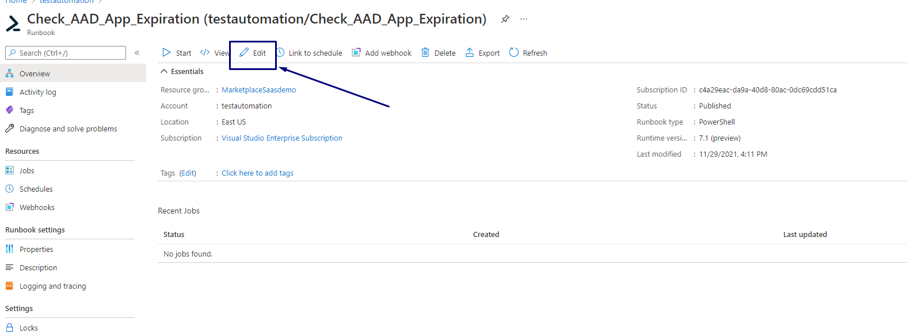

Before publishing run maunal test to ensure the script will run correct.
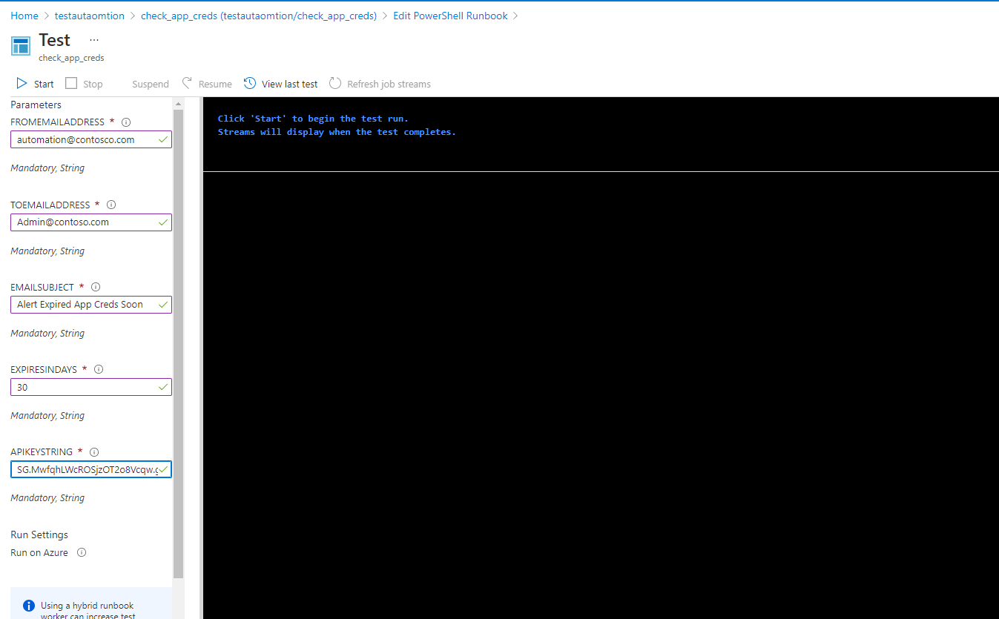
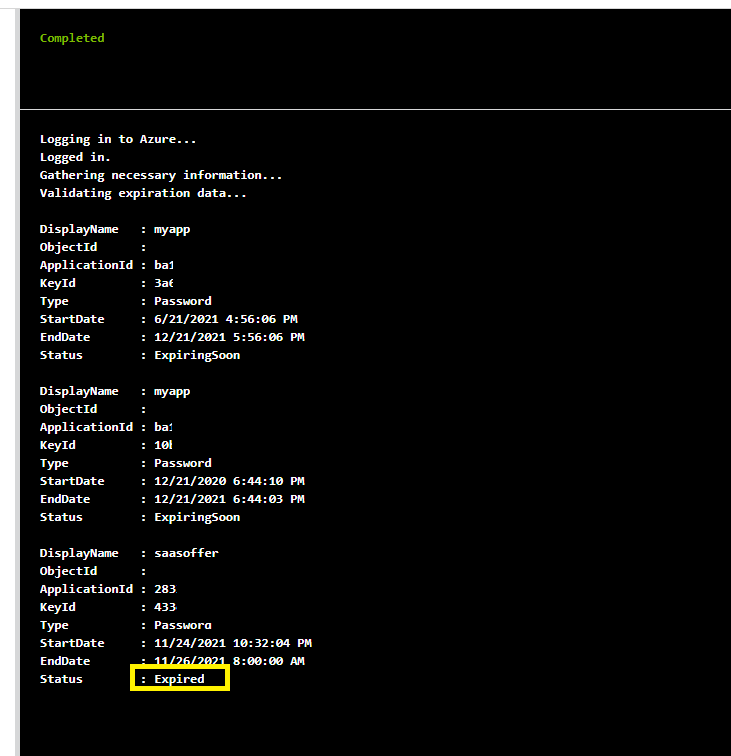

SendGrid will send email like the following
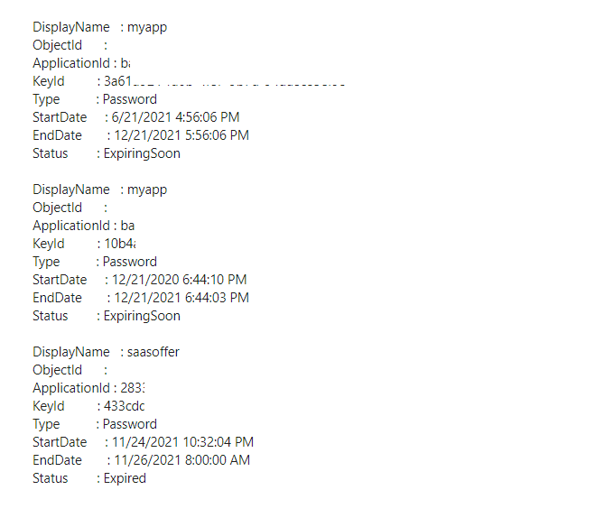

Now after passing the test. **Publish** The runbook

### 4- Add Schedule
From Automation main page click on Schedules then click **Add a schedule**
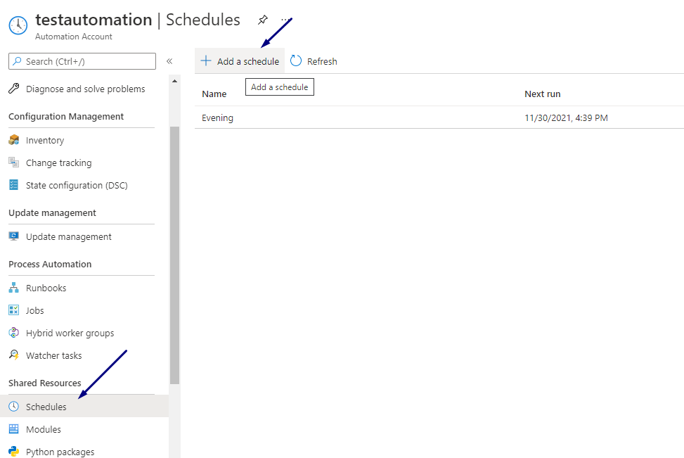

Fill the schedule information as following to execute a runbook once a day

Once the runbook is published and schedule in place. From runbook page Click on **Link to Schedule **

fill the runbook parameters
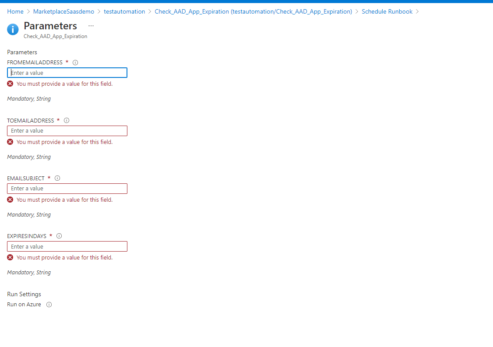

Then Select The schedule

### Summary
This section shows How-To monitor Application Credentials using a workaround solution by implementing the following assests
- Create and Config SendGrid
- Create and Config Azure Automation
- Create and Test Runbook
- Create and Schedule
- Link Schedule to Runbook

### Other Monitor Recommendation 
- [Web App Monitoring and Alert instruction](./docs/WebApp-Monitoring.md).
- [SQL Server Monitoring and Alert instruction](./docs/SQL-Server-Monitoring.md).
