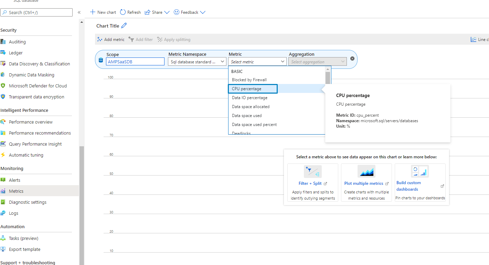
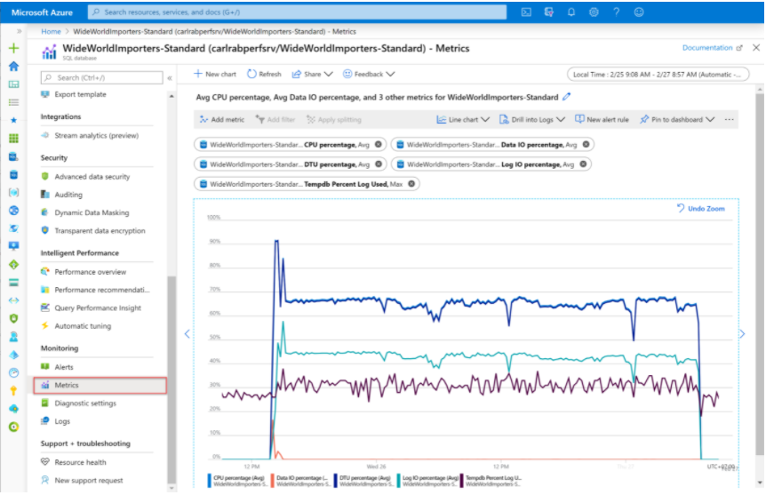
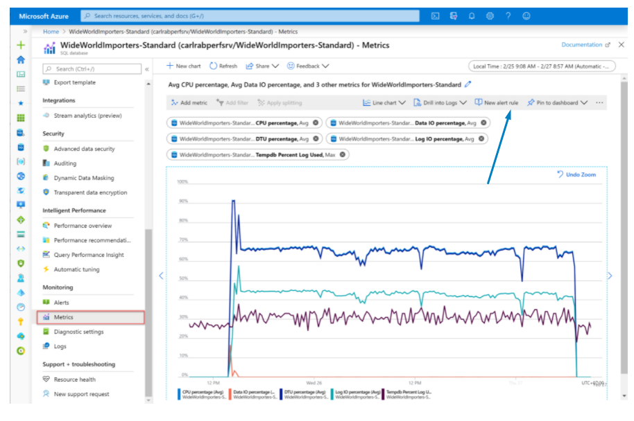
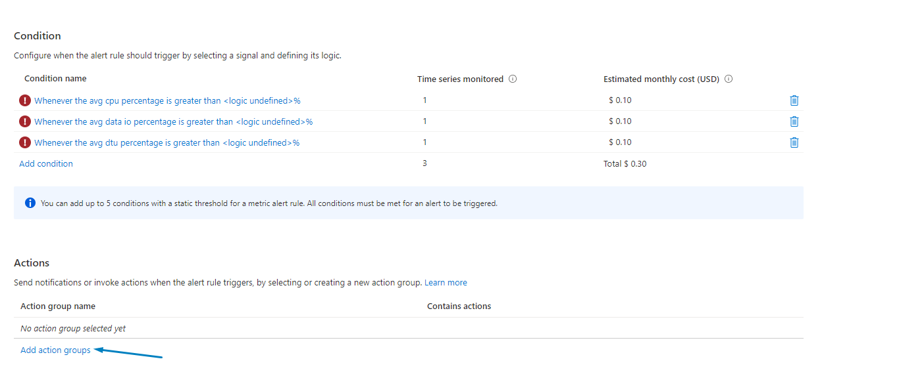
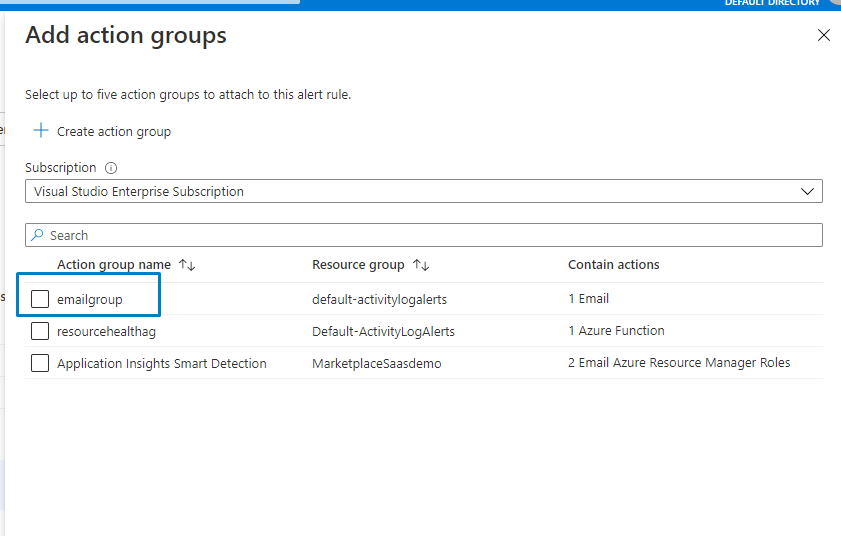
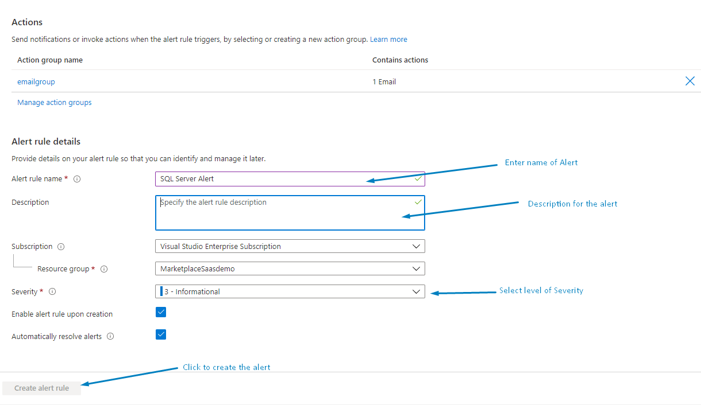

# Azure SQL Managed Database Performance and Monitoring
To monitor the performance of a database in Azure SQL Database and Azure SQL Managed Instance, start by monitoring the CPU and IO resources used by publisher workload relative to the level of database performance publisher chosed in selecting a particular service tier and performance level. 

To accomplish this, Azure SQL Database and Azure SQL Managed Instance emit resource metrics that can be viewed in the Azure portal.

The following metrics enable punlisher to see if a database is reaching 100% of
 - processor
 - memory
 -  IO resources
 
  High DTU or processor percentage, as well as high IO percentage, indicates that your workload might need more CPU or IO resources. It might also indicate queries that need to be optimized.
 
### 1- Add Metrics
 From Main page for Azure SQL database click Metrics Then click on metrics dropdown list and select "CPU percentage"
 

Repeat the steps for memory and IO Resources

### 2- Add Alert
From the Metrics dashboard click **New Alert Rule**

Azure Metrics service will open Alert page where publisher add Action groups

Select Email Action Group

Fill Alert rule details

Click create alert rule.

For more about the **Action Groups**]** please refer to [Microsoft Docs](https://docs.microsoft.com/en-us/azure/azure-monitor/alerts/action-groups).

  
### Summary
This section shows How-To 
- Create SQL performance and monitoring metrics
- Create Alert to notify group or person.

### Other Monitor Recommendation
- [Web App Monitoring and Alert instruction](./docs/WebApp-Monitoring.md).
- [App Registration Credentials Monitoring and Alert instruction](./docs/App-Reg-Monitoring.md).